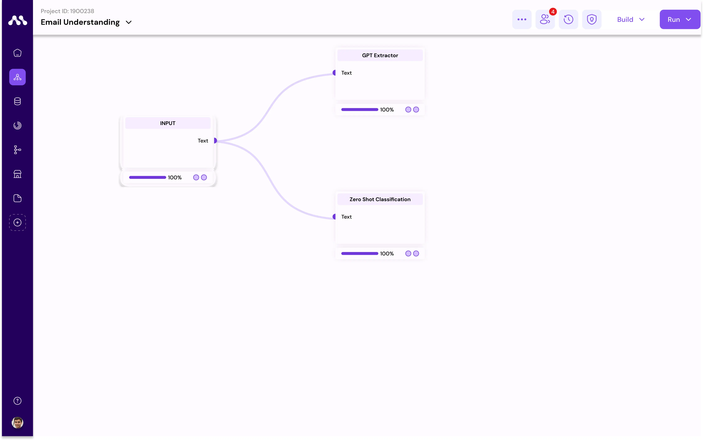

# Data Labelling On Customer Email

### Advanced Customer Email Understanding

From above use-case 2 you have learnt about customer email understanding on the basis of sentiment and summary, In this scenario, we're implementing a custom text classification block for understanding customer emails based on sentiment and summary. The process involves data preparation, model training, deployment, and endpoint integration.

For this process we'll use old flow which is used in use-case&#x20;

1. Get into the Create Project Page,
2. Click on options
3. Click on Duplicate
4. click on the duplicated project and click rename&#x20;

Next step adding Another addition block to the Same flow&#x20;

1. **Download Block**:\
   Download Annotation block for Data preparation
2. **Access Component Menu**:\
   Navigate to the component menu.
3. **Drag and Drop**:\
   Drag and drop blocks to the workspace.


<figure><figcaption></figcaption></figure>

7. **Configure Inputs**:\
   1\. Use the editor menu to configure data for the input block. \
   2\.  Select dataset of Email.\


<figure><figcaption></figcaption></figure>

8. **Connect Blocks**:\
   1\. Connect input block to the GPT-extractor block.\
   2\. Drag a line between one block node to another block node to make connection.
9. **Configure GPT Extraction Block:**\
   1\. Fill the Details of instruct with this code.

<pre><code><strong>Extract Transaction ID, Amount, and Translate to English from the givenRextInput.
</strong>Fill the data extracted to outputJsonFormat, map corresponding value with respect to key of json.
</code></pre>

&#x20;    2\. Fill the Details of another code block with Output JSON to extract the Information.

```
{
    "Transaction ID": "",
    "Amount": "",
    "TranslateToEnglish": ""
}
```

<figure><figcaption></figcaption></figure>

9. **Configure Zero-Shot Classification Block:**
   1. Configure the block with different labels to understand the emails
   2. labels are likely to be payment, delivery, food menu, coupons.&#x20;

<figure><figcaption></figcaption></figure>

10. **Configure Annotation Block**
    1. add Labelstudio code to fix the labels

```json
<View>
  <Text name="text" value="$text"/>
  <Choices name="topics" toName="text" choice="single">
    <Choice value="Payment"/>
    <Choice value="food menu"/>
    <Choice value="coupons"/>
    <Choice value="delivery"/>
  </Choices>
</View>
```

<figure><figcaption></figcaption></figure>

10. **Run All**:
    1. Click Run-All program to start the flow running sequentially.
11. **Checkout the Outputs**:
    1. Checkout the Output of Every block and understand the Block and Outputs


<figure><figcaption></figcaption></figure>


### **Annotating and Saving Your Data**

#### Step 1: Access the Annotation Block

* After completing your data processing run, navigate to the annotation block in your application interface.

#### Step 2: Annotate Emails

* Review the outputs displayed in the annotation block.
* Label the emails by considering their content and context. The application provides several label options for categorization.

#### Step 3: Save Your Annotations

* Name your annotated dataset for easy identification.
* Ensure you select the "text-classification" pipeline before saving. This categorizes your data correctly for future processes.

### **Custom Model Training with Custom Labeled Data**

#### Step 1: Access Augmatrix Model Hub

1. Visit the Augmatrix Model Hub to start the process of training a new model.

#### Step 2: Use the Model Explorer

1. Within the Model Hub, navigate to the Model Explorer section.
2. Apply a filter to see only the "Text Classification Pipeline" options.

#### Step 3: Prepare for Training

1. Choose a model from the list that fits your needs.
2. Assign a unique name to your model to distinguish it from others.
3. Select the dataset you annotated earlier for training.

#### Step 4: Start Training in Google Colab

1. Follow the provided link or instructions to initiate the model training in Google Colab.
2. Once the training is complete, your new model will be available in the Trained Model Hub.

### **Custom Model Deployment**

#### Step 1: Begin Deployment Process

1. Go to the Trained Model Hub and find your newly trained model.
2. Click on the "Deploy" option to start the deployment process.

#### Step 2: Create a Deployment Token

1. Navigate to your user profile settings to create a new token.
2. Provide a name for the token and confirm with your password.
3. Upon creation, copy the provided token for later use.

#### Step 3: Configure Deployment Settings

1. **Machine Size:** Choose the size of the machine that best suits your deployment needs.
2. **Computation Type:** Select between GPU and CPU based on your model's requirements.
3. **Cloud Service Options:** Decide if you prefer User Managed or Augmatrix Managed cloud services.
4. **POD Size:** Specify the size of the POD to match the scale of your deployment.
5. **Number of POD's:** Determine the number of POD's you need for your application.
6. **Autoscaling Options:** Choose the autoscaling method, whether it's Request based or Usage based.
7. **Minimum Number of POD's:** Set the minimum number of POD's to ensure your service remains available.
8. **Maximum Number of POD's:** Define the maximum number of POD's to control resource usage.
9. **Endpoint Type:** Decide if your endpoint will be Public or Private according to your security and accessibility needs.

#### Step 4: Deploy Your Model

1. Review all selected options and confirm your deployment settings.
2. Click on "Deploy" to initiate the deployment of your custom-trained model.
3. You'll get End-point for your deployed model based on your endpoint selection

#### **Integrating Model Endpoint into Email Understanding Workflow**

**Step 1: Access Workflow**

1. Navigate to the **Workflows** section of the platform that hosts your email understanding process.

**Step 2: Download Component**

1. Within the workflow interface, locate the **Component menu**.
2. Search for and download the **text-classification block** suitable for email categorization or sentiment analysis.

**Step 3: Add Component to Workspace**

1. Use the **drag and drop** functionality to add the text-classification block to your workflow workspace.
2. This block is essential for classifying the content of emails based on predefined categories.

**Step 4: Connect Components**

1. Establish a connection from the **Input block** (your email data source) to the newly added **text-classification block**.
2. This ensures that emails will be automatically fed into the text-classification model for analysis.

**Step 5: Configure Text-Classification Block**

1. Select the text-classification block within your workflow.
2. Configure it by inputting the **Deployed Endpoint** URL of your custom-trained model.
3. This step is crucial for the block to know where to send the email content for classification.

<figure><figcaption></figcaption></figure>

**Step 6: Run the Workflow**

1. Click on the **RUN block** to initiate the workflow.
2. This process will classify emails according to the model's training, applying labels or categories as configured.

**Step 7: Review Output**

1. After the workflow completes, inspect the **Output** from the text-classification block.
2. The output will display the classification results for each email, which can be used for further analysis or routing emails based on their content.

By following these steps, you'll successfully integrate a custom text-classification model into your email understanding workflow, enhancing its capability to automatically categorize and understand email content more effectively.
