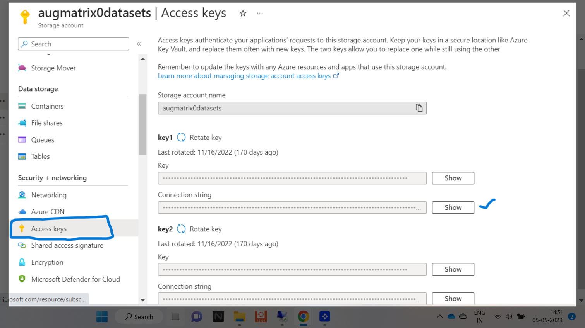

# Data store

## DATA PRIVACY AND SECURITY

At Augmatrix.io, we prioritize data privacy and security, ensuring a safe environment for both the platform and its users. Here's how we maintain the highest level of security and privacy:

#### **1. Bring Your Own Data-Store**

We provide users with the flexibility to configure their own cloud storage, ensuring data security without the risk of leakage. Users can either test sample datasets with Augmatrix.io's default datastore or configure their preferred cloud storage solution. We support various cloud storage capabilities, including:

1. **Amazon S3**
2. **Azure Blob Storage**
3. **Google Cloud Bucket**

Below are step-by-step configurations for each cloud storage option:

### **1. Amazon S3 Configuration with Augmatrix.io Platform**

1. Go to the Data Manager page.
2. Click on "Mount New Drive."
3. Select "Store" as Amazon S3.
4. Provide a name for the drive.
5. Obtain the endpoint URL, access key, and secret key from your Amazon S3 bucket.
   * Create a bucket on Amazon S3.
   * Copy the bucket's URL (remove the "https" part) for the endpoint section.
   * Access IAM on Amazon and create access keys. Use the access and secret keys for Augmatrix platform.
6. Set "Secret" to True and specify the region for the bucket.
7. Configure bucket permissions by adding CORS code for data extraction to Augmatrix platform.

### **2. Azure Storage Blob Configuration with Augmatrix.io Platform**

1. Navigate to the Data Manager page.
2. Click on "Mount New Drive."
3. Select "Azure" as storage.
4. Provide a name for the drive.
5. Enter the storage account name and account key (connection string).
   * Create a storage account on Azure.
   * Inside the storage account, create a container.
   * Obtain the account name and key from the Azure portal for Augmatrix platform.

<figure><figcaption>
Azure images
</figcaption></figure>

### **3. Google Storage Configuration with Augmatrix.io Platform**

1. Visit the Data Manager page.
2. Click on "Mount New Drive."
3. Provide a name for the drive (bucket name).
4. Enter the account key obtained from the Google Cloud console.
   * Create a bucket in Storage Management on Google Cloud.
   * Grant READ and WRITE permissions.
   * Generate an API key in the Google Cloud console and paste it into the Augmatrix.io platform.



Follow these steps carefully to ensure seamless integration and secure handling of your data. For detailed instructions on creating buckets and obtaining keys, refer to the provided links.

