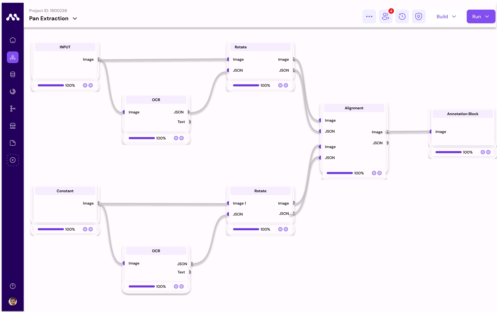
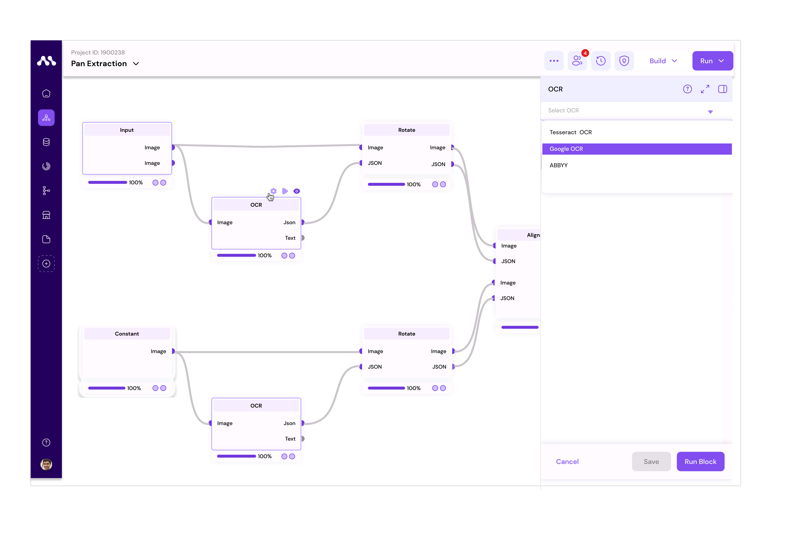
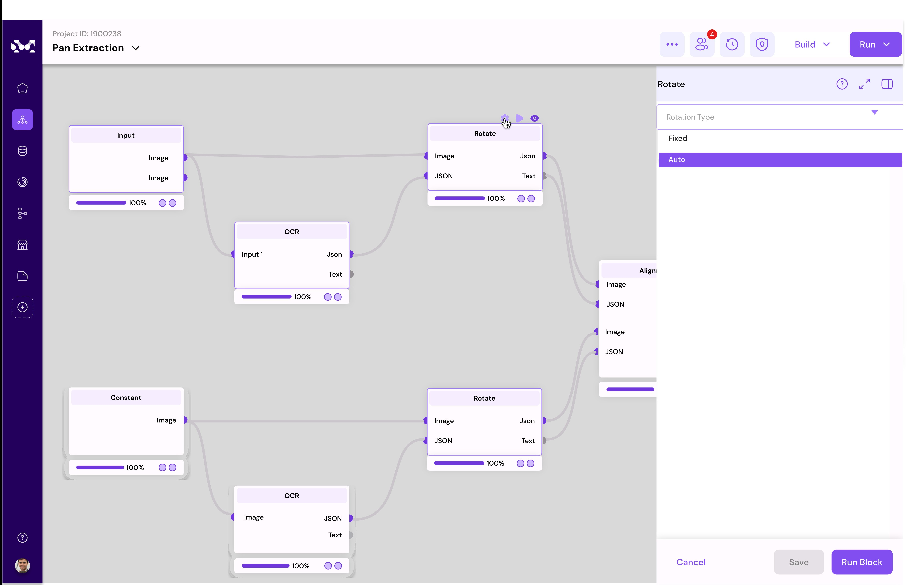
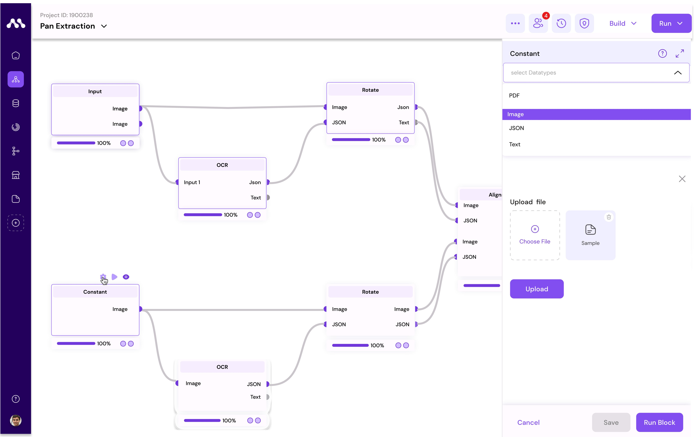
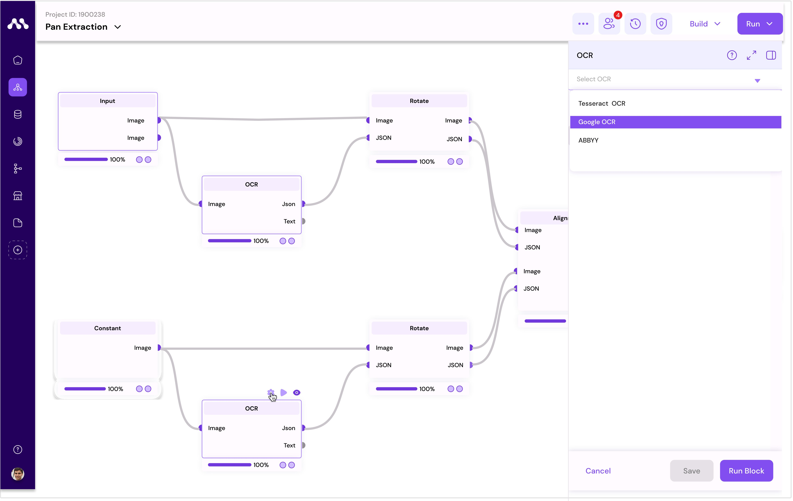
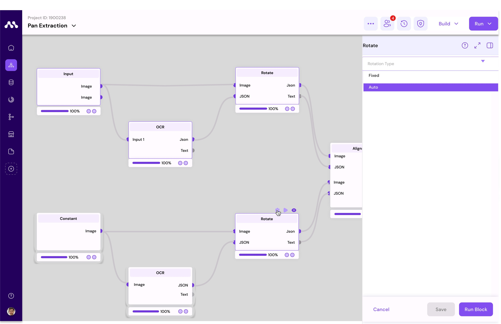
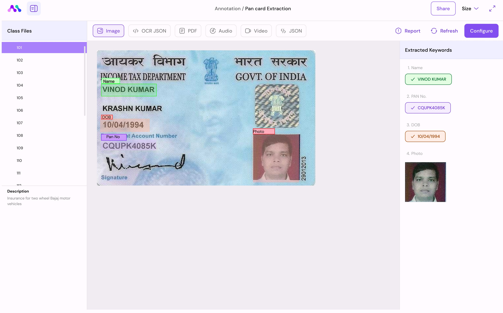

# Flow

### Flow-page Overview

The Flow-page serves as a canvas where you can construct workflows by connecting pre-built blocks. Here's a breakdown of the key elements and functionalities:

### Components

* **Workspace**: This is where you drag and drop components from the component menu. Configure inputs using the editor menu and save or start the process of the block here.
* **Component Menu**: Pre-built blocks are listed here for selection.
* **Component Store**: Download components to the component menu from here.
* **Editor Menu**: Make changes to the workspace as per your requirements.

#### Functionalities

* **Save**: Preserve created components for future modification or processing.
* **Run All**: Execute all functions sequentially after configuring block properties and inputs without interruption.
* **RUN**: Run individual blocks one-by-one to perform specific functions.
* **Undo**: Reverse the last user action in case of mistakes or changes of mind.
* **Redo**: Repeat the last undone action, useful for correcting mistakes or reapplying changes.
* **Lock**: Restrict block movement in the workspace by locking components; unlock to enable movement.
* **Zoom In**: Enlarge displayed content for focusing on specific details.
* **Fit**: Adjust displayed content to fit within the visible area of the screen or window.
* **Zoom Out**: Reduce the size of displayed content to see more on the screen at once.
* **DEPLOY**: When ready to take use cases live, deploy seamlessly using various modes (scheduled, Web Endpoint, or Event Driven).
* **Console**: CLI for live coding on the component level and executing live.

### Example Use Case: Customer Email Understanding

In this example, you'll understand emails and respond according to the email context using sample data and pre-built blocks.\

1. **Upload Dataset**: \
   Upload the dataset to the default datastore provided by Augmatrix.io.

Here is the sample dataset providing for testing purpose&#x20;


sample data


1. **Create Sample Project**:\
   &#x20;Create a sample project in APPS.
2. **Enter Project**: Access the project.
3. **Open Component Store**: \
   Open the component store.
4. **Download Blocks**: \
   Download input and GPT-extractor blocks.
5. **Access Component Menu**: \
   Navigate to the component menu.
6. **Drag and Drop**: \
   Drag and drop blocks to the workspace.
7. **Configure Inputs**:\
   &#x20;Use the editor menu to configure data for the input block.
8. **Connect Blocks**: \
   Connect input block to the GPT-extractor block.
9. **Run All**: \
   Click Run-All program to start the flow running sequentially.
10. **Check Outputs**: \
    Examine the output of individual blocks.

By following these steps, you'll effectively set up and run the email understanding workflow.

### Pan-card Extraction Use-case

In this example, we'll delve into the intricacies of the Pan Card extraction process. We'll elucidate each step of the workflow, detailing the configurations of individual blocks and the final output.&#x20;

Moreover, we'll showcase how this flow can be adapted for extracting Aadhaar cards or similar documents.

<figure><figcaption>
Sample Work-flow image
</figcaption></figure>

1. **Input Configuration:** Begin by configuring the dataset you wish to process and execute the respective block.

<figure><figcaption></figcaption></figure>

here, Pan-card is selected as the input to extract the data&#x20;

2. **OCR (Optical Character Recognition) Block:** The OCR block extracts data from images provided by the input block. It outputs the extracted data in both JSON and text formats.

<figure><figcaption></figcaption></figure>

3. **Rotate Block:** This block adjusts the angle of the card to ensure proper alignment for processing. It takes an image and OCR JSON as input to correct the orientation.

<figure><figcaption></figcaption></figure>

4. **Constant Block:** Containing fixed information of a reference image, this block serves as a benchmark for aligning input card images. It provides a standard reference for comparison

<figure><figcaption></figcaption></figure>

Here we've provided one sample reference image to extract

5. **OCR (Constant Block):** Similar to the OCR block, this component processes the reference image provided by the Constant Block and produces JSON and text outputs.

<figure><figcaption></figcaption></figure>

6. **Rotate Block (Constant Block):** This block, like the previous Rotate Block, corrects the orientation of the reference image based on the OCR results obtained from the Constant Block.&#x20;

<figure><figcaption></figcaption></figure>

7. **Alignment Block:** Utilizing the data from the Constant Block, this component aligns the information extracted from input cards with the standard reference.
8. **Annotation Block:** Primarily used for labeling data, the Annotation Block annotates the extracted information and facilitates the extraction of labeled data.

<figure><figcaption></figcaption></figure>

9. **Output:** The final output encapsulates comprehensive information, including aligned data and labeled information, providing a cohesive overview of the extracted data.

&#x20;

<figure><figcaption></figcaption></figure>

**Conclusion:** By following this structured workflow and configuring each block appropriately, one can efficiently extract data from Pan Cards or similar documents. This adaptable approach can be extended to extract data from various document types, such as Aadhaar cards, with minor adjustments to the configurations.

\
