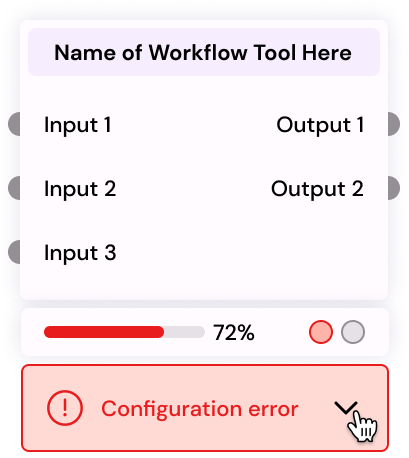
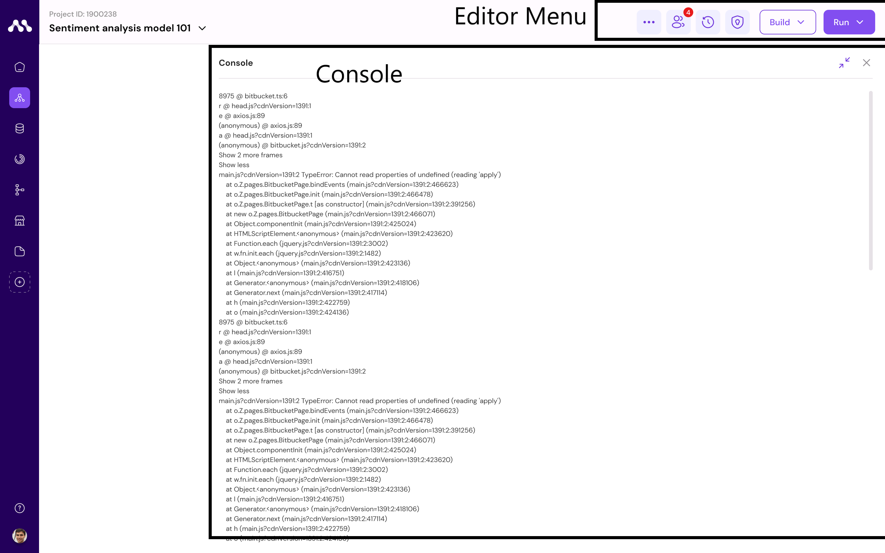
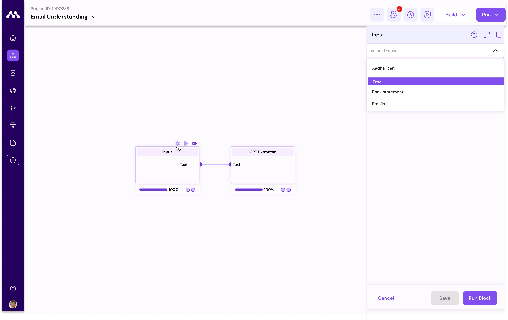
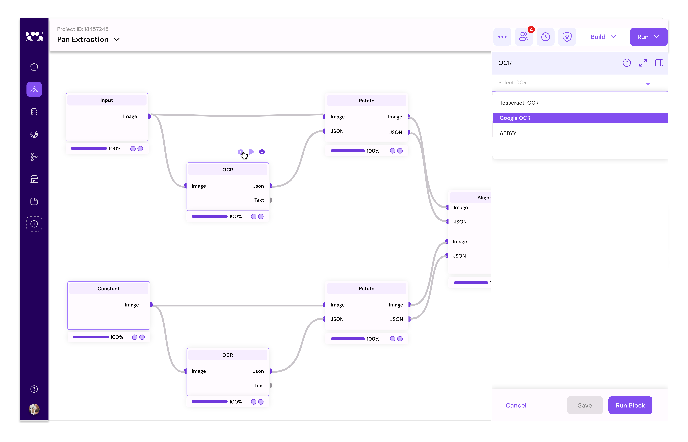
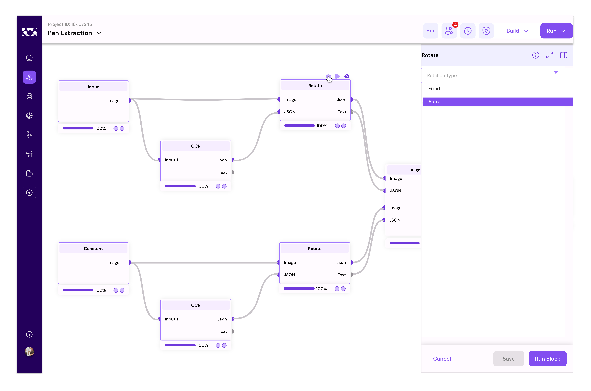
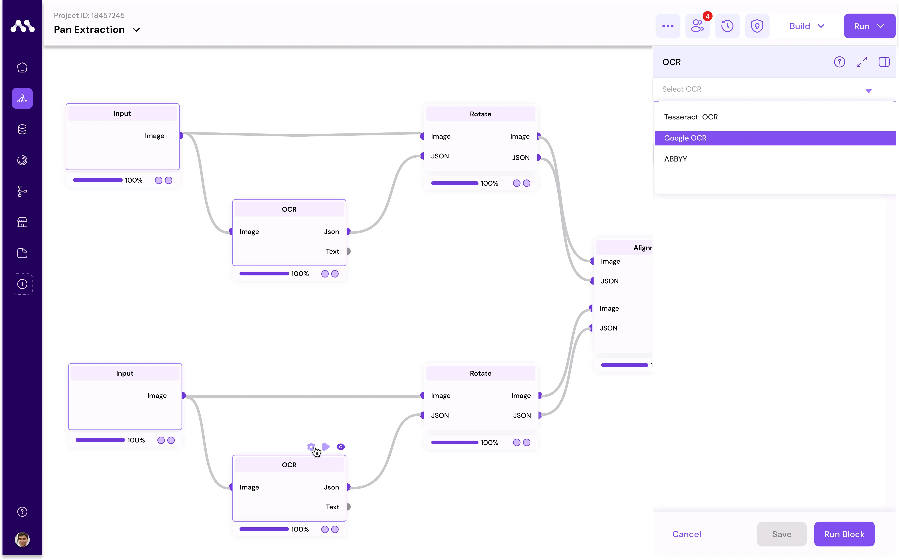
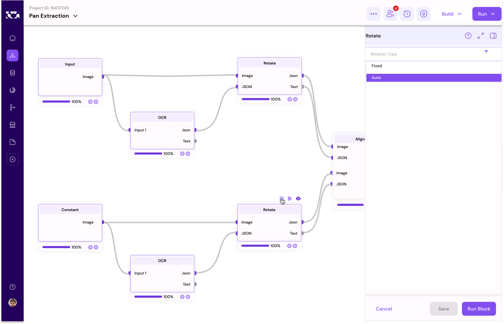
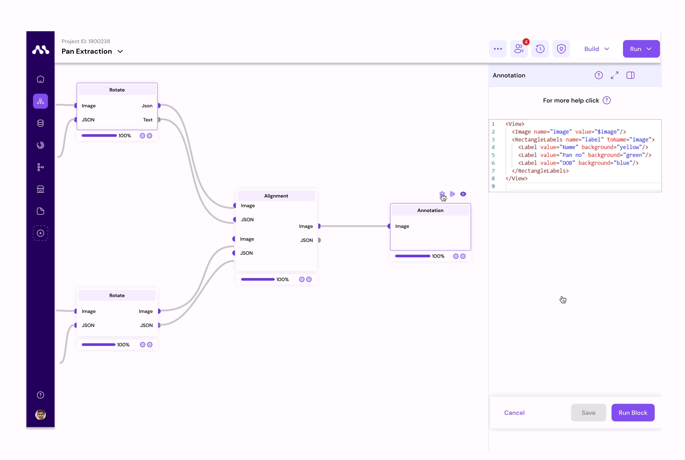
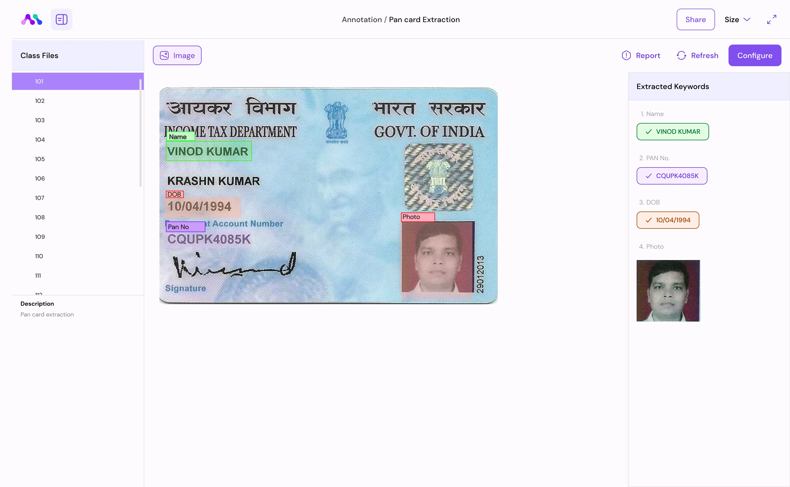

# Flow

Flow-page Overview

The Flow-page serves as a canvas where you can construct workflows by connecting pre-built blocks. Here's a breakdown of the key elements and functionalities:

### Components

<figure><figcaption></figcaption></figure>

* **Workspace**: This is where you drag and drop components from the component menu. Configure inputs using the editor menu and save or start the process of the block here.
* **Component Menu**: Pre-built blocks are listed here for selection.
* **Marketplace** : Download components from marketplace to the component menu .
* **Editor Menu**: Make changes to the workspace as per your requirements.

### Crafting Your Workflow: A Step-by-Step Guide

1. **The Art of Drag and Drop**
   * Move blocks from the Component store to the workspace with ease. It's all about matching the right components, like fitting puzzle pieces together based on their data types.
2.  **Understanding Block Statuses**

    * &#x20;Configuration Errors: Think of these as alerts that something's not quite right with your setup.


    <figure><figcaption></figcaption></figure>

    * Runtime Warning : These indicate issues within your data, but don't worry, not all is lost—some parts can still proceed.


    <figure><figcaption></figcaption></figure>

    * Runtime error: These indicate, the block ran without data and correct Configurations.

    <figure><figcaption></figcaption></figure>

    &#x20;

    * Success Indicators: This indicates Your block is correctly configured, and your data is  \
      flowing smoothly.

<figure><figcaption></figcaption></figure>


2.  **Connecting Blocks:** The Right Fit

    * &#x20;Correct Connection: ensure the data types align for a perfect fit.


    <figure><figcaption></figcaption></figure>

    * Incorrect connection: this means you've connected but issue with data type mismatch


    <figure><figcaption></figcaption></figure>
3. **Dive into Block Data**
   * Observe the block you're able to understand the data type ,if you hover into the connection or node point you're able to see the variables.
4. **Editor menu**

<figure><figcaption></figcaption></figure>

* **Save**: Preserve created components for future modification or processing
* **Run** : Run individual blocks one-by-one to perform specific functions.
* **Undo**: Reverse the last user action in case of mistakes or changes of mind.
* **Lock**: Restrict block movement in the workspace by locking components; unlock to enable movement.
* Notification:  it contains product updates, Workflow Notifications etc.&#x20;
* Menu:  In this menu you can see these options.
  1. **Run All**: Execute all functions sequentially after configuring block properties and inputs without interruption.
  2. **Zoom In**: Enlarge workflow for focusing on specific details.
  3. **Fit**: Adjust workflow to fit within the visible or reset to original size.
  4. **Zoom Out**: Reduce the size of displayed content to see more on the screen at once.
  5. **Deploy**: When ready to take use cases live, deploy seamlessly using various modes (scheduled, Web Endpoint, or Event Driven).
  6. **Redo**: Repeat the last undone action, useful for correcting mistakes or reapplying changes
  7. **Console**: The Console lets you see the activity logs of each block in your workflow. This helps you track what each block is doing and if there are any issues.

### Example Use Case: Customer Email Understanding

In this example, you'll understand emails and respond according to the email context using sample data and pre-built blocks.\\

1. **Upload Dataset**:\
   Upload the dataset to the default datastore provided by Augmatrix.io.

Here is the sample dataset providing for testing purpose


sample data


1. **Create Sample Project**:\
   Create a sample project in APPS.
2. **Enter Project**: Access the project.
3. **Open Component Store**:\
   Open the component store.
4. **Download Blocks**:\
   Download input and GPT-extractor blocks.
5. **Access Component Menu**:\
   Navigate to the component menu.
6. **Drag and Drop**:\
   Drag and drop blocks to the workspace.


<figure><figcaption></figcaption></figure>

7. **Configure Inputs**:\
   1\. Use the editor menu to configure data for the input block. \
   2\.  Select dataset of Email \


<figure><figcaption></figcaption></figure>

8. **Connect Blocks**:\
   1\. Connect input block to the GPT-extractor block.\
   2\. Drag a line between one block node to another block node to make connection
9. Configure GPT Extraction Block:\
   1\. Fill the Details of instruct with this code&#x20;

<pre><code><strong>Extract Transaction ID, Amount, and Translate to English from the givenRextInput.
</strong>Fill the data extracted to outputJsonFormat, map corresponding value with respect to key of json.
</code></pre>

&#x20;    2\. Fill the Details of another code block with Output JSON to extract the Information

```
{
    "Transaction ID": "",
    "Amount": "",
    "TranslateToEnglish": ""
}
```

<figure><figcaption></figcaption></figure>

9. **Run All**:\
   Click Run-All program to start the flow running sequentially.
10. **Check Outputs**:\
    Examine the output of individual blocks.


<figure><figcaption></figcaption></figure>

By following these steps, you'll effectively set up and run the email understanding workflow.

### Pan-card Extraction Use-case

In this example, we'll delve into the intricacies of the Pan Card extraction process. We'll elucidate each step of the workflow, detailing the configurations of individual blocks and the final output.

Moreover, we'll showcase how this flow can be adapted for extracting Aadhaar cards or similar documents.

<figure><figcaption></figcaption></figure>

1. **Input Configuration:** Begin by configuring the dataset you wish to process and execute the respective block.
   1. Select Dataset, Here Pan card is our dataset

<figure><figcaption></figcaption></figure>

2. **OCR (Optical Character Recognition) Block:** The OCR block extracts data from images provided by the input block. It outputs the extracted data in both JSON and text formats.
   1. Select the OCR engine to process, we've multiple, but you've to select at least one.
   2. We've selected Google OCR

<figure><figcaption></figcaption></figure>

3. **Rotate Block:** This block adjusts the angle of the card to ensure proper alignment for processing. It takes an image and OCR JSON as input to correct the orientation.
   1. Rotate orientation must be select in the block level,&#x20;
   2. Select Auto

<figure><figcaption></figcaption></figure>

4. **Constant Block:** Containing fixed information of a reference image, this block serves as a benchmark for aligning input card images. It provides a standard reference for comparison
   1. select Any Pan-card reference image.

<figure><figcaption></figcaption></figure>

Here we've provided one sample reference image to extract

5. **OCR (Constant Block):** Similar to the OCR block, this component processes the reference image provided by the Constant Block and produces JSON and text outputs.
   1. Same as top OCR, we've selected Google OCR

<figure><figcaption></figcaption></figure>

6. **Rotate Block (Constant Block):** This block, like the previous Rotate Block, corrects the orientation of the reference image based on the OCR results obtained from the Constant Block.

<figure><figcaption></figcaption></figure>

6. **Alignment Block:** Utilizing the data from the Constant Block, this component aligns the information extracted from input cards with the standard reference.
7. **Annotation Block:** Primarily used for labelling data, the Annotation Block annotates the extracted information and facilitates the extraction of labelled data.
   1. Here the data labelling will happen for this one we need to label studio code here is the sample code

```
<View>
  <Image name="image" value="$image"/>
  <RectangleLabels name="label" toName="image">
    <Label value="Name" background="yellow"/>
    <Label value=" PAN" background="green"/>
    <Label value="DOB" background="blue"/>
  </RectangleLabels>
</View>
```

<figure><figcaption></figcaption></figure>

9. **Output:** The final output encapsulates comprehensive information, including aligned data and labelled information, providing a cohesive overview of the extracted data.

<figure><figcaption></figcaption></figure>

By following, the above structured workflow and configuring each block appropriately, one can efficiently extract data from Pan Cards or similar documents. This adaptable approach can be extended to extract data from various document types, such as Aadhaar cards, with minor adjustments to the configurations.
