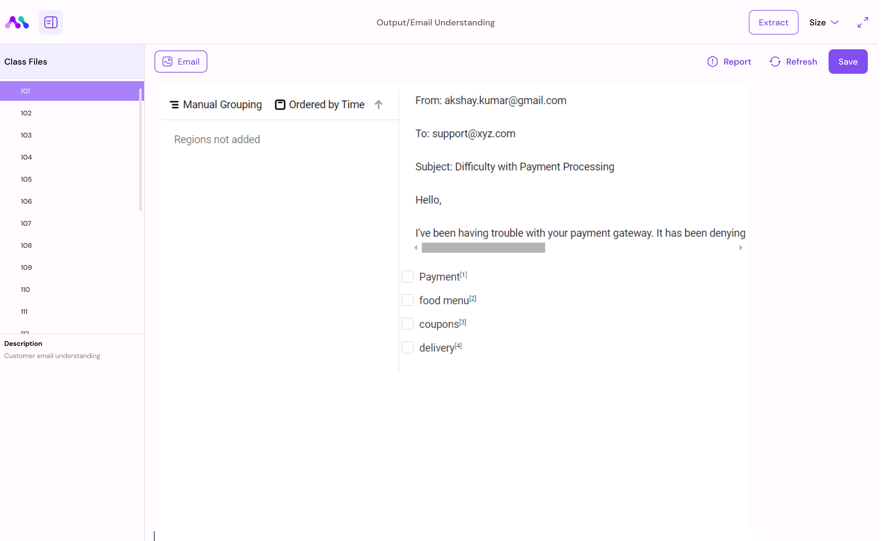

# Flow

Flow-page Overview

The Flow-page serves as a canvas where you can construct workflows by connecting pre-built blocks. Here's a breakdown of the key elements and functionalities.

### Components

<figure><figcaption></figcaption></figure>

* **Workspace**: This is where you drag and drop components from the component menu. Configure inputs using the editor menu and save or start the process of the block here.
* **Component Menu**: Pre-built blocks are listed here for selection.
* **Marketplace** : Download components from marketplace to the component menu.
* **Editor Menu**: Make changes to the workspace as per your requirements.

### Crafting Your Workflow: A Step-by-Step Guide

1. **The Art of Drag and Drop**
   * Move blocks from the Component store to the workspace with ease. It's all about matching the right components, like fitting puzzle pieces together based on their data types.
2.  **Understanding Block Statuses**

    * &#x20;Configuration Errors: Think of these as alerts that something's not quite right with your setup.

    <figure><figcaption></figcaption></figure>

    * Runtime Warning : These indicate issues within your data, but don't worry, not all is lost—some parts can still proceed.

    <figure><figcaption></figcaption></figure>

    * Runtime error: These indicate, the block ran without data and correct Configurations.

    <figure><figcaption></figcaption></figure>

    &#x20;

    * Success Indicators: This indicates Your block is correctly configured, and your data is  \
      flowing smoothly.

<figure><figcaption></figcaption></figure>

2.  **Connecting Blocks:** The Right Fit

    * &#x20;Correct Connection: ensure the data types align for a perfect fit.

    <figure><figcaption></figcaption></figure>

    * Incorrect connection: this means you've connected but issue with data type mismatch

    <figure><figcaption></figcaption></figure>
3. **Dive into Block Data**
   * Observe the block you're able to understand the data type ,if you hover into the connection or node point you're able to see the variables.
4. **Editor menu**

<figure><figcaption></figcaption></figure>

* **Save**: Preserve created components for future modification or processing.
* **Run** : Run individual blocks one-by-one to perform specific functions.
* **Undo**: Reverse the last user action in case of mistakes or changes of mind.
* **Lock**: Restrict block movement in the workspace by locking components; unlock to enable movement.
* **Notification**:  it contains product updates, Workflow Notifications etc.&#x20;
* **Menu:**  In this menu you can see these options.
* **Run All**: Execute all functions sequentially after configuring block properties and inputs without interruption.
* **Zoom In**: Enlarge workflow for focusing on specific details.
* **Fit**: Adjust workflow to fit within the visible or reset to original size.
* **Zoom Out**: Reduce the size of displayed content to see more on the screen at once.
* **Deploy**: When ready to take use cases live, deploy seamlessly using various modes (scheduled, Web Endpoint, or Event Driven).
* **Redo**: Repeat the last undone action, useful for correcting mistakes or reapplying changes.
* **Console**: The Console lets you see the activity logs of each block in your workflow. This helps you track what each block is doing and if there are any issues.
