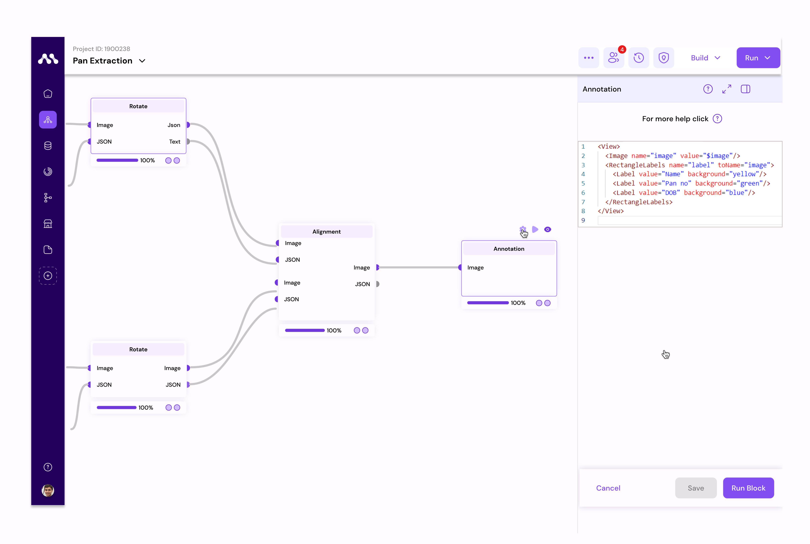
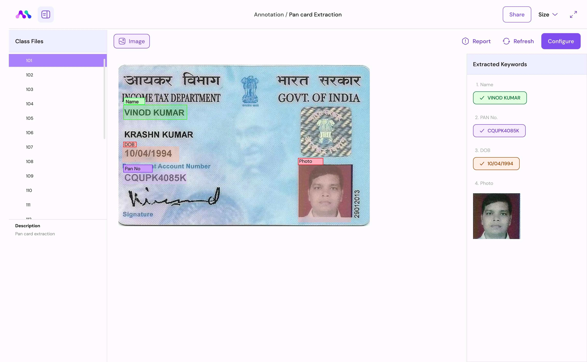

# KYC Extraction Use case

### Pan-card Extraction Use-case

In this example, we'll delve into the intricacies of the Pan Card extraction process. We'll explain each step of the workflow, detailing the configurations of individual components and the final output.

Moreover, we'll showcase how this flow can be adapted for extracting Aadhaar cards or similar documents.

<figure><figcaption></figcaption></figure>

1. **Input Configuration:** Begin by configuring the dataset you wish to process and execute the respective component.
   1. Select Dataset, Here Pan card is our dataset.

<figure><figcaption></figcaption></figure>

2. **OCR (Optical Character Recognition)Component:** The OCR component extracts data from images provided by the input component
3. . It outputs the extracted data in both JSON and text formats.
   1. Select the OCR engine to process, we've multiple, but you've to select at least one.
   2. We've selected Google OCR.

<figure><figcaption></figcaption></figure>

3. **Rotate Component:** This Component adjusts the angle of the card to ensure proper alignment for processing. It takes an image and OCR JSON as input to correct the orientation.
   1. Rotate orientation must be select in the Component level.
   2. Select Auto.

<figure><figcaption></figcaption></figure>

4. **Constant Component:** Containing fixed information of a reference image, this component serves as a benchmark for aligning input card images. It provides a standard reference for comparison
   1. select Any Pan-card reference image.

<figure><figcaption></figcaption></figure>

Here we've provided one sample reference image to extract

5. **OCR (Constant Component):** Similar to the OCR component, this component processes the reference image provided by the Constant component and produces JSON and text outputs.
   1. Same as top OCR, we've selected Google OCR.

<figure><figcaption></figcaption></figure>

6. **Rotate Component  (Constant Component):** This Component, like the previous Rotate component, corrects the orientation of the reference image based on the OCR results obtained from the Constant Component.

<figure><figcaption></figcaption></figure>

6. **Alignment Component:** Utilizing the data from the Constant Component, this component aligns the information extracted from input cards with the standard reference.
7. **Annotation Component:** Primarily used for labelling data, the Annotation Component annotates the extracted information and facilitates the extraction of labelled data.
   1. Here the data labelling will happen for this one we need to label studio code here is the sample code.

```
<View>
  <Image name="image" value="$image"/>
  <RectangleLabels name="label" toName="image">
    <Label value="Name" background="yellow"/>
    <Label value=" PAN" background="green"/>
    <Label value="DOB" background="blue"/>
  </RectangleLabels>
</View>
```

<figure><figcaption></figcaption></figure>

9. **Output:** The final output encapsulates comprehensive information, including aligned data and labelled information, providing a cohesive overview of the extracted data.

<figure><figcaption></figcaption></figure>

By following, the above structured workflow and configuring eachCompoent appropriately, one can efficiently extract data from Pan Cards or similar documents. This adaptable approach can be extended to extract data from various document types, such as Aadhaar cards, with minor adjustments to the configurations.
