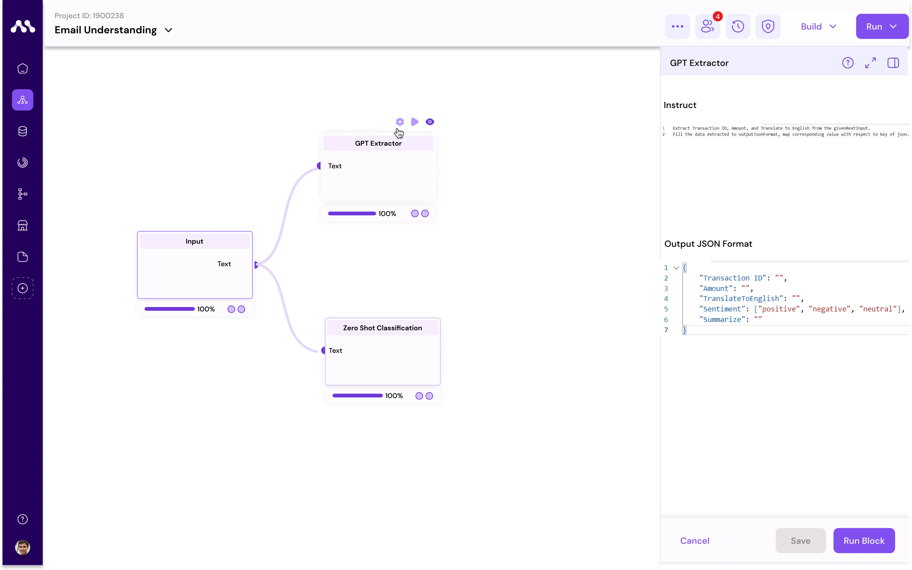
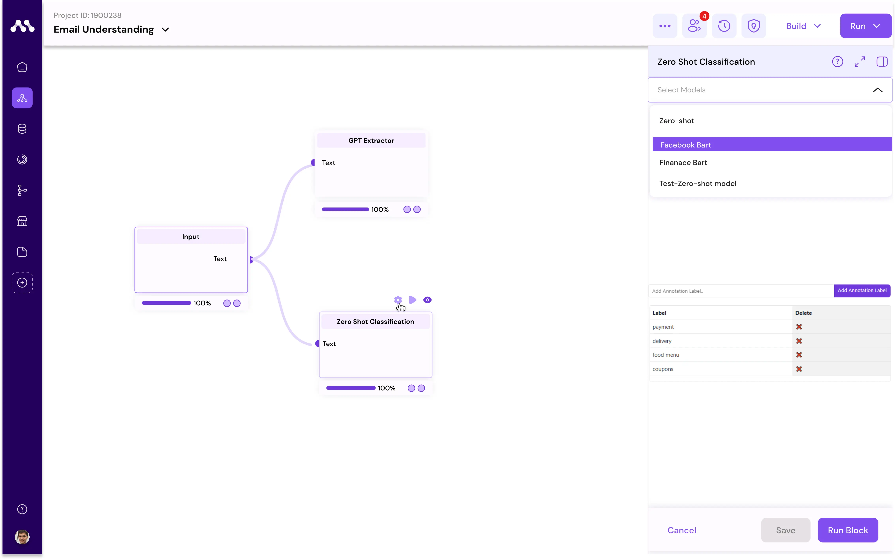

# Use case 2

### Customer Email Understanding

In this example, you'll understand email analysis and response system for restaurant transactions, efficiently manages various email types, including inquiries on payments, transactions, and menus. It parses emails, gauges sender sentiment, summarizes content, and extracts essential information for quick responses. By automating these processes, our system enhances communication, improves accuracy, and boosts customer satisfaction. Additionally, it provides valuable insights into customer preferences, aiding in better decision-making for restaurant operations.&#x20;

1. **Upload Dataset**:\
   Upload the dataset to the default datastore provided by Augmatrix.io.

Here is the sample dataset providing for testing purpose


sample data


1. **Create Sample Project**:\
   Create a sample project in APPS.
2. **Enter Project**: Access the project.
3. **Open Component Store**:\
   Open the component store.
4. **Download Blocks**:\
   Download input, GPT-Extractor block and Zero-shot Classification blocks.&#x20;
5. **Access Component Menu**:\
   Navigate to the component menu.
6. **Drag and Drop**:\
   Drag and drop blocks to the workspace.


<figure><figcaption></figcaption></figure>

7. **Configure Inputs**:\
   1\. Use the editor menu to configure data for the input block. \
   2\.  Select dataset of Email.\


<figure><figcaption></figcaption></figure>

8. **Connect Blocks**:\
   1\. Connect input block to the GPT-extractor block.\
   2\. Drag a line between one block node to another block node to make connection.
9. **Configure GPT Extraction Block:**\
   1\. Fill the Details of instruct with this code.

<pre><code><strong>Extract Transaction ID, Amount, and Translate to English from the givenRextInput.
</strong>Fill the data extracted to outputJsonFormat, map corresponding value with respect to key of json.
</code></pre>

&#x20;    2\. Fill the Details of another code block with Output JSON to extract the Information.

```
{
    "Transaction ID": "",
    "Amount": "",
    "TranslateToEnglish": ""
}
```

<figure><figcaption></figcaption></figure>

9. **Configure Zero-Shot Classification Block:**
   1. Configure the block with different labels to understand the emails
   2. labels are likely to be payment, delivery, food menu, coupons.&#x20;

<figure><figcaption></figcaption></figure>

10. **Run All**:
    1. Click Run-All program to start the flow running sequentially.
11. **Check Outputs**:
    1. Examine the output of individual blocks.


<figure><figcaption></figcaption></figure>

By following these steps, you'll effectively set up and run the email understanding workflow.
