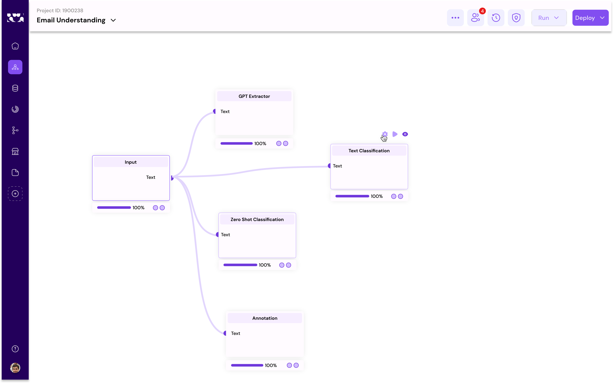

# Workflow Deployment

To integrate your system or automate tasks using workflow deployment, you can make your use case live and deploy them effortlessly through various modes, such as scheduled, Web Endpoint, or Event-Driven deployments. Below is a brief overview of how to deploy a sample workflow. For full workflow examples and to explore specific use cases, you are encouraged to check out the [**example use cases** ](example-use-cases/)provided.

**Deployment Modes:**

* **Scheduled:** Choose this mode if you want your workflow to run at specified times. This is ideal for tasks that need to occur regularly, such as daily data backups or weekly reports.
* **Web Endpoint:** Select this mode if you need your workflow to be triggered via a web request. This is useful for tasks that should occur as a result of a specific action.
* **Event-Driven:** Opt for this mode if your workflow should be triggered by specific events within your system, such as a new file being uploaded to a server or a specific database updates.

#### Steps for Sample Workflow Deployment:

1. **Identify Your Use Case:** Determine the task or system integration you wish to automate or make more efficient with workflow deployment.
   1. Go to Augmatrix platform
   2. Access the workflow from Create project page
   3. Use[ **Data labelling on Customer email**](example-use-cases/data-labelling-on-customer-email.md)&#x20;
   4. Click on Deploy from the editor menu&#x20;
   5. Select the Deployment Mode (Scheduled or Web-Endpoint or Event-driven)

<figure><figcaption></figcaption></figure>
